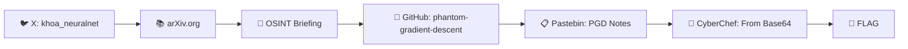

# 🕵️ Write-up bài MISC_1

---

## 📝 Tổng quan

> [!NOTE]
> Bài **MISC_1** vì trong quá trình giải không lưu screenshot nên em tóm tắt lại quá trình giải như sau.

Đây là một bài dạng **OSINT (Open Source Intelligence)**, yêu cầu lần theo dấu vết thông tin công khai qua nhiều nền tảng khác nhau để tìm ra flag cuối cùng.

## 🔍 Quá trình truy vết

<table>
<tr><th>Bước</th><th>Hành động</th><th>Nền tảng</th></tr>
<tr>
<td>1️⃣</td>
<td>Truy cập trang cá nhân của <b>Nguyễn Minh Khoa</b> (<code>@khoa_neuralnet</code>)</td>
<td>🐦 X (Twitter)</td>
</tr>
<tr>
<td>2️⃣</td>
<td>Tìm kiếm thông tin/bài báo liên quan</td>
<td>📚 arXiv.org</td>
</tr>
<tr>
<td>3️⃣</td>
<td>Mở tài liệu <b>OSINT Mission Briefing</b></td>
<td>📄 Document</td>
</tr>
<tr>
<td>4️⃣</td>
<td>Truy cập repository <code>minhkhoa-ai/phantom-gradient-descent</code></td>
<td>🐙 GitHub</td>
</tr>
<tr>
<td>5️⃣</td>
<td>Mở ghi chú <b>PGD Research Notes</b></td>
<td>📋 Pastebin.com</td>
</tr>
<tr>
<td>6️⃣</td>
<td>Tìm kiếm công cụ giải mã</td>
<td>🔎 Google → "cyberchef"</td>
</tr>
<tr>
<td>7️⃣</td>
<td>Giải mã chuỗi Base64 thu được, lấy flag</td>
<td>🧪 CyberChef — <i>From Base64</i></td>
</tr>
</table>

## 🚩 Kết quả

Sau khi đưa dữ liệu thu thập được từ **Pastebin** qua recipe **`From Base64`** trên CyberChef, chuỗi được giải mã ra flag.

## 💡 Kết luận

> [!IMPORTANT]
> Đây là dạng bài **OSINT chuỗi manh mối (breadcrumb trail)** — mỗi nền tảng chỉ hé lộ một phần dấu vết dẫn tới nền tảng tiếp theo, và bước giải mã cuối cùng dùng **Base64** để lộ ra flag.

| Thông tin | Chi tiết |
|:---|:---|
| 🎯 **Dạng bài** | OSINT (Open Source Intelligence) |
| 🧵 **Manh mối xuất phát** | Tài khoản X `@khoa_neuralnet` |
| 🐙 **Repo GitHub** | `minhkhoa-ai/phantom-gradient-descent` |
| 🔐 **Mã hóa cuối** | Base64 |
| 🛠️ **Công cụ giải mã** | CyberChef |

